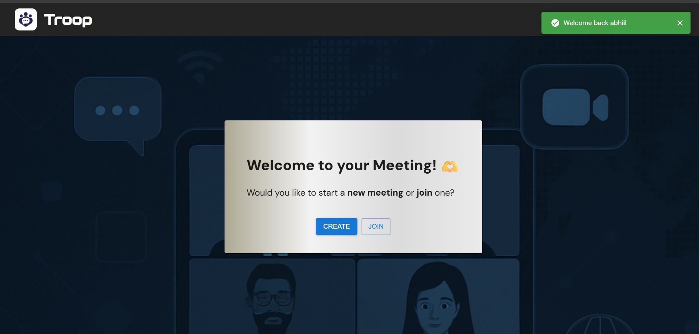
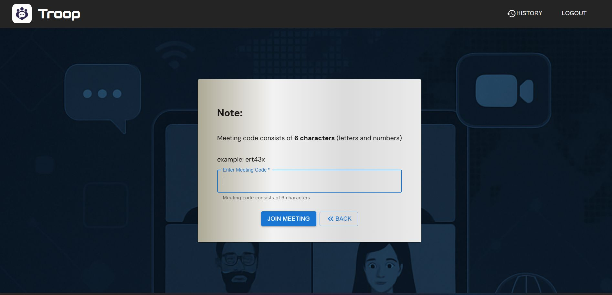
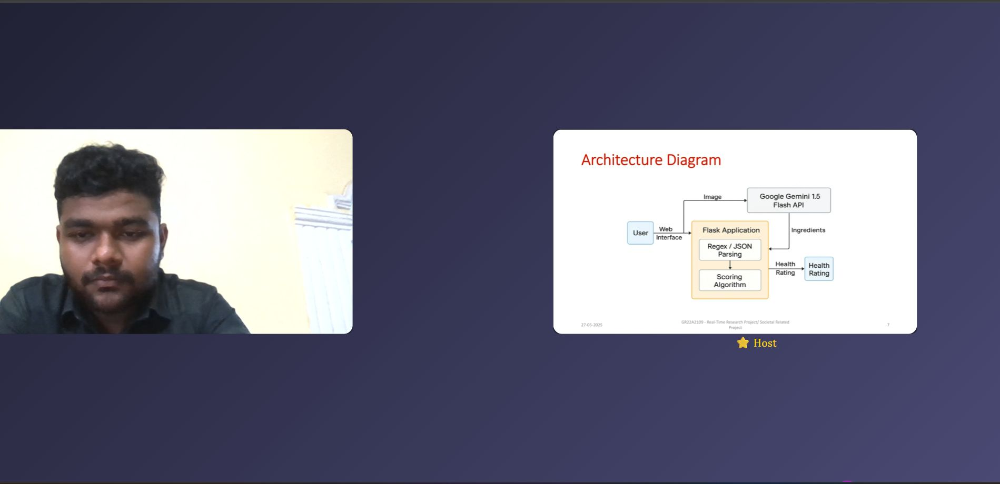
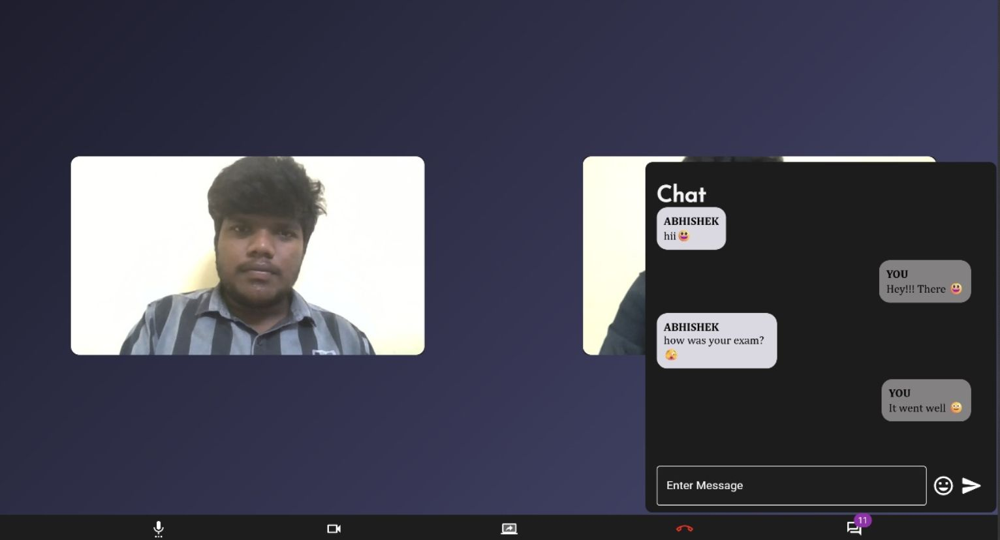

***TROOP*** – Full-Stack Video Conferencing Platform

Troop is a real-time video conferencing platform that allows users to quickly create or join meetings using a unique meeting code, enabling fast access to private sessions without unnecessary steps.

Live Demo: https://troop-1.onrender.com

***Features***

- Create or join meetings with a custom username

- Real-time video and audio communication using WebRTC

- Screen sharing support for better collaboration

- Live chat with real-time updates alongside video

- Meeting history tracking and user activity logging

***Tech Stack***

- Frontend: React.js

- Backend: Node.js + Express

- WebRTC: Real-time peer-to-peer video/audio + screen sharing

- Socket.IO: Signalling and live chat functionality

- JWT: Secure user authentication

- MongoDB: Stores meeting and user data

- emoji-picker-react: Enables emojis in the live chat

##Screenshots
**Landing Page**

**Home Page**

**Join Meeting**

**Video Call**

**Screen Sharing**

**Live Chat**

